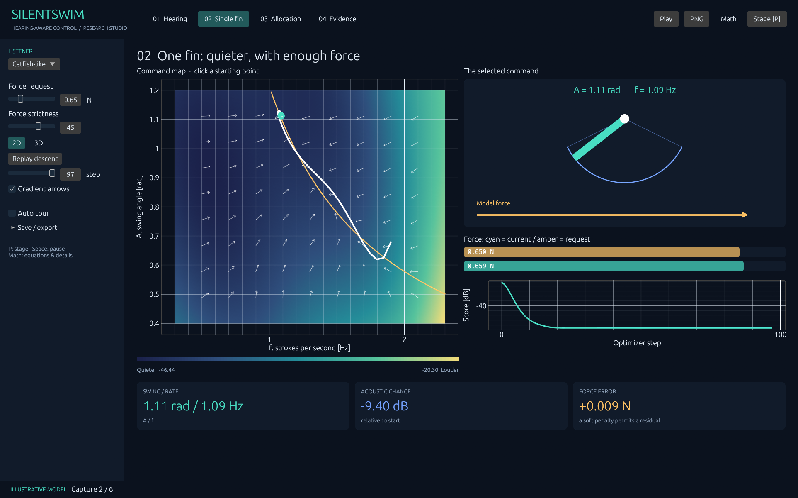
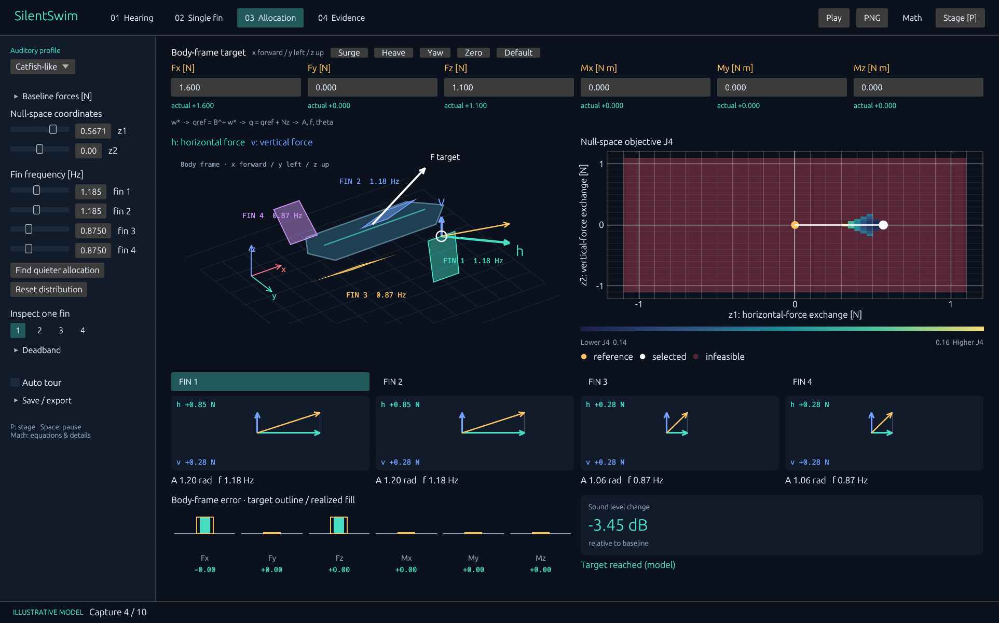

# SilentSwim Studio

A native **Rust + egui** mathematical demo studio for *SilentSwim: Embedding Auditory Sensitivity into Differentiable Control Allocation of Underwater Robots*. Designed for an expert-facing conference video or interactive demonstration.

**This is a theory demonstrator, not an experimental reproduction.** Interactive acoustics, audiograms, force calibration and robot geometry are explicitly illustrative. The Evidence page separately displays the aggregate measurements reported in the supplied manuscript. No unpublished PDF, learned weights or experimental recordings are bundled.

**v0.3 adds Linux builds and body-frame target inputs.** Use **Math** in the top bar to reveal the full equations, matrices, curvature and expert controls.





## Download and run

Download **silentswim-studio.exe** from [Releases](https://github.com/hama6767/silentswim_demo/releases/latest), then double-click it. The Windows x64 release uses a statically linked MSVC runtime. No Rust, Python, model download, or network connection is needed to run the app. A graphics driver with OpenGL support is required. Release binaries are unsigned.

The ZIP contains the same executable plus this guide and the mathematical notes. SHA256 checksums accompany each release.

### Linux x64

Download `silentswim-studio-v0.3.0-linux-x64.tar.gz` from Releases, extract it and run:

```sh
tar -xzf silentswim-studio-v0.3.0-linux-x64.tar.gz
./silentswim-studio
```

Built on Ubuntu 22.04 for x86-64, with glibc 2.35 or newer. Requires an X11 or Wayland desktop and OpenGL. On Ubuntu/Debian, install runtime libraries if needed with `sudo apt install libxkbcommon0 libxkbcommon-x11-0 libgl1 libwayland-client0 libfontconfig1`. File dialogs use the desktop portal (`xdg-desktop-portal` and a backend matching your desktop). This is a native binary, not an AppImage. The tarball preserves executable permissions; if downloading the standalone `silentswim-studio-linux-x64` asset, run `chmod +x silentswim-studio-linux-x64` first.

### Body-frame target → allocation

Allocation starts with six numeric inputs: **Fx, Fy, Fz [N]** and **Mx, My, Mz [N m]**. Axes are **x forward, y left, z up**, with right-handed moments. Drag a value or double-click to type. Surge, Heave, Yaw, Zero and Default presets set the whole target. The white arrow on the robot shows the target force direction (display length is capped); moment components remain in the numeric row.

1. Enter the target. The demo computes the minimum-norm baseline `qref = B⁺ w*`. The target remains unchanged, including when it exceeds fin limits. `Baseline forces [N]` in the sidebar shows its h/v components.
2. Changing a target resets z to zero and selects each baseline frequency as 1.5 Hz clamped into that fin's admissible interval. An invalid baseline is labeled explicitly. This initial allocator does not search for a different feasible baseline under actuator constraints.
3. Change z1/z2 or use `Find quieter allocation`. The existing null-space/inverse-force optimizer operates around this baseline.
4. Compare the target with **actual** values reconstructed from the final fin commands. The bottom bars show target outlines, realized fills, and signed errors. Invalid command pairs do not receive an acoustic improvement value.

`Reset distribution` preserves the body target. Scene version 2 saves all six target components; version 1 scenes keep their original fin-force reference. Numerical export includes `body-wrench.csv` with target, baseline, selected, realized and residual columns.

## Four linked workspaces

| Workspace | Expert-facing controls and displays |
| --- | --- |
| **01 Hearing** | Log-frequency threshold interpolation; normalized auditory weights with finite support; PSD and weighted PSD; cumulative energy integral; within-profile command comparison |
| **02 Single fin** | Acoustic, total-cost and signed-force-residual heatmaps; 3D orbitable surfaces; local derivatives and Hessian eigenvalues; analytical constant-force contours; negative gradient field; click-to-initialize descent; stepwise convergence; force-penalty sweep |
| **03 Allocation** | Body-frame force/moment inputs and baseline allocation; animated four-fin geometry; two-dimensional null-space cost/feasibility map; six-variable automatic differentiation and Adam refinement; analytical amplitude inversion; per-fin frequency feasibility; B/N matrices; all six wrench components reconstructed after deadband |
| **04 Evidence** | Table I objective ablation with mean ± SD; Table II closed-loop acoustic and tracking results; explicit speed-tracking tradeoff; validation statistics |

All plots support hover inspection and normal egui_plot navigation. 3D scenes support drag-to-orbit and double-click-to-reset. The white marker is the selected command, cyan indicates the current model, and amber marks a reference or force contour. Red/burgundy means actuator or final-wrench feasibility failed.

## 発表・動画向けの使い方

1. **Hearing** で Catfish-like / Salmon-like / Broadband を切り替え、周波数重みによって評価が変わることを示します。
2. **Single fin** で左の命令マップと右のフィンの動き、目標と現在の力バーを見比べます。`Force strictness` で力の誤差への罰則を調整します。2D上のクリックで初期値を変え、`Replay descent` で探索を再生。`2D / 3D` で表示を切り替えます。数式・ヘッセ行列・目的関数の切替は上部の **Math** にあります。
3. **Allocation** は上部の Fx/Fy/Fz [N] と Mx/My/Mz [N m] に機体座標系の目標を入力するところから始めます。直下の actual が最終命令から再計算した値です。左側の `Baseline forces [N]` で基準配分を確認できます。水色 **h** は各フィンの局所的な横方向の力、青 **v** は縦方向の力で、どちらも単位は **N** です。右図はロボットの位置ではなく、分担を変える `z1 / z2` の地図です。点を動かすと4枚の分力と合力が変わり、下の6成分の棒で基準との一致を確認できます。各フィンの矢印はカード間で共通スケール、6本の棒は成分別スケールで、下の数値は基準との差です。`Find quieter allocation` で2個のzと4個の周波数をまとめて探索します。B/N行列・正確な各成分の値は **Math** で表示します。
4. **Evidence** で実測集計結果を示します。特に速度追従RMSEの増加を含め、音響改善と追従性能を分けて説明します。

UIは国際会議でそのまま収録しやすい英語表記です。仮データの画面には `ILLUSTRATIVE MODEL` を常時表示します。

③のマップは、現在の4つの周波数を固定した目的関数 **J4** の断面です。色には音響項と変更への罰則が含まれ、赤紫はその周波数・振幅範囲・デッドバンドで実現できない配分を示します。金の点は基準、白の点は選択中の配分です。周波数を動かすとマップも変わります。

### Stage and capture

- `P`: large presentation layout, with the control sidebar hidden and a chapter caption displayed.
- `F11`: fullscreen. `Escape`: leave fullscreen/stage, or cancel an export.
- `Space`: play/pause. `1`–`4`: select chapter.
- `Right` / `Left`: step forward/backward through the single-fin solution.
- `Ctrl+S` or **PNG**: save the complete view at the current rendered resolution.
- **Automatic chapter tour**: a repeating 48-second mathematical walkthrough.
- **Video / frame sequence → Export deterministic tour**: choose duration (4–120 seconds) and frame rate (10–60 fps). The app creates a new subdirectory with a fixed-time PNG sequence and `encode-mp4.ps1` / `encode-mp4.sh`. Export duration is independent of rendering speed. Keep the window size and DPI unchanged during export.

To encode MP4, install FFmpeg with H.264 support separately, then run in PowerShell:

```powershell
./encode-mp4.ps1
# Or specify its executable explicitly:
./encode-mp4.ps1 -Ffmpeg 'C:/tools/ffmpeg/bin/ffmpeg.exe'
```

On Linux, run `sh encode-mp4.sh` (optionally set `FFMPEG=/path/to/ffmpeg`).

PNG capture and frame-sequence export need no external program. FFmpeg is only needed to encode the final MP4. The encoder refuses to overwrite an existing MP4.

**Save scene / Load scene** preserves the profile and mathematical control parameters as validated JSON. **Export numerical CSV** writes the optimizer path, synthetic spectrum, current allocation, scene JSON and provenance. The app does not send commands to a physical robot.

## Mathematics and provenance

See [docs/MATHEMATICS.md](docs/MATHEMATICS.md) for equations, exact illustrative parameter choices, solver differences, edge cases and test coverage. See [docs/DEMO_SCRIPT.md](docs/DEMO_SCRIPT.md) for a 90-second presentation outline.

## Build and verify

Rust stable and a native compiler/linker are required. On Ubuntu install build dependencies with `sudo apt install build-essential pkg-config libxkbcommon-dev libxkbcommon-x11-dev libwayland-dev libx11-dev libgl1-mesa-dev libfontconfig1-dev`. On Windows use Rust's `x86_64-pc-windows-msvc` target and Visual Studio C++ Build Tools.

```text
cargo test --locked
cargo clippy --locked --all-targets -- -D warnings
cargo fmt --all -- --check
rustfmt --edition 2024 --check src/views.rs src/export.rs src/graphics.rs
cargo run --release --locked
```

For automated **real native render capture** (ten views, then exit):

```text
silentswim-studio.exe --capture-all --out captures
```

This requires a desktop graphics session; it is not a headless HTML mock. It exercises 2D/3D single-fin views, allocation and matrices, hearing, evidence, zero targets, signed six-axis targets, high valid targets and an invalid target. One allocation case uses presentation mode.

For reproducible video-frame export without file dialogs (then exit):

```text
silentswim-studio.exe --export-tour --seconds 24 --fps 30 --out captures/my-tour
```

Use a new empty output folder. Local validation includes native capture of all ten views and a complete 40-frame tour with CSV/JSON and encoder-script export.

## GitHub Actions release

- `Verify` runs formatting, numerical tests, Clippy and a Windows build, plus Linux tests/Clippy on pushes to `main` and pull requests.
- Pushing a semantic-version tag such as `v0.3.0` runs `Release`: verify both platforms, compile Windows x64 (static CRT) and Linux x64, render ten native Linux views under Xvfb/Mesa, package binaries, ZIP/tar.gz and checksums, then publish together.
- `Release` can also be dispatched manually with an **existing tag**. Publishing is isolated in a job with `contents: write`; build jobs have read-only permissions.
- `Cargo.lock` is committed and every CI build uses `--locked`.

## Source layout

`ad.rs`: six-component forward AD. `model.rs`: acoustics, force inversion, single-fin solver and null-space allocation. `canvas.rs`: native 3D mathematical surfaces and robot schematic. `app.rs` / `views.rs`: interactive workspaces. `export.rs`: scene validation, numerical export, deterministic tour and native framebuffer capture.
